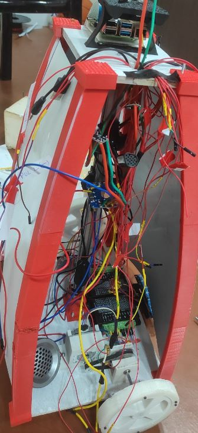
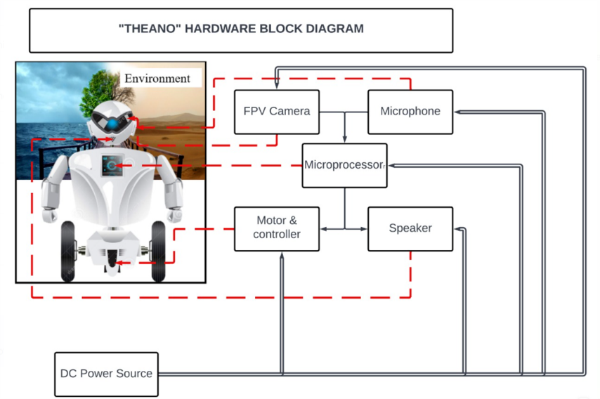

# Theano-The-Chaperone
## Introduction
Museums serve as repositories of cultural, historical, artistic, and scientific treasures, offering visitors an opportunity for education and enlightenment. However, navigating through the vast collections and interpreting the significance of artifacts can be daunting for many visitors. To address this challenge, we present a solution: an autonomous indoor tour guide robot designed to enhance the museum experience. This robot, equipped with cutting-edge technology including Object Detection, Natural Language Processing, and obstacle avoidance mechanisms, aims to provide informative and interactive tours while minimizing the reliance on human guides. By offering a user-friendly interface, voice-enabled interactions, and cost-effective navigation, our robot endeavors to make museum exploration accessible, engaging, and enriching for all visitors.

## Motivation
**Motivation:**
Our motivation stems from a desire to revolutionize the museum experience by addressing the challenges faced by visitors in understanding and appreciating artifacts. Recognizing the limitations of traditional museum tours, where valuable information often goes unnoticed due to the absence of dedicated guides or visitor engagement, we envision an autonomous indoor tour-guide robot as a solution. By leveraging cutting-edge technology, including Natural Language Processing and interactive touchscreen displays, our robot aims to provide every visitor with an accessible, informative, and engaging tour experience. Our primary goal is to reduce reliance on human labor while ensuring that all visitors, including the visually impaired, have the opportunity to explore and understand artifacts in an inclusive and enriching manner. Through the integration of advanced features and user-friendly interfaces, we aspire to captivate visitors and create a truly immersive and memorable museum visit for everyone.

## Requirements Analysis
### Software Requirements
The system requires the following software components:

1. **GPU—TPU for training:** GPU or TPU is necessary for efficient training of machine learning models.
   
2. **Tensorflow, PyTorch, OpenCV, Pandas, NumPy:** Essential libraries for machine learning, computer vision, and data processing tasks.

3. **Creating Supervised examples:** Tools and methods for generating labeled training examples to train the machine learning models.

4. **Trained Models:** Pre-trained machine learning models for object detection, natural language processing, or other relevant tasks.

5. **Code Editor:** A software environment for writing and editing code, such as Visual Studio Code, PyCharm, or Jupyter Notebook.

6. **Dataset:** A dataset containing relevant data for training and testing the machine learning models.

7. **HC-05 Config Tool (To work with Bluetooth module):** Software tool for configuring and managing the HC-05 Bluetooth module for communication with external devices.

### Hardware Requirements
The system consists of the following essential hardware devices:

1. **Robot body:** Custom-designed robot body, 3D printed, and reinforced with an aluminum extrusion structure.

2. **Large Display 26.69cm (10.5”):** A LED screen display for presentation and facial expression purposes.

3. **Neck mechanism:** Mechanism utilizing a worm and worm wheel, driven by a stepper motor, to provide degrees of freedom in the neck area.

4. **Prime mover:** NEMA 4.2 kg-cm stepper motors used as the primary driving force for movement.

5. **Arduino and Bluetooth module:** Arduino microcontroller along with a Bluetooth module for receiving signals from the main microprocessor and controlling motors accordingly.

6. **Motor shield:** A motor shield to protect the microcontroller and organize circuit connections.

7. **DC portable battery:** Portable battery to provide uninterrupted power supply to all elements of the system.

## Introduction:-
A robot is being developed with capabilities to operate and explain physical exhibits through interaction with visitors.
This robot also takes into account other factors like choosing the shortest path, collision detection and hence making the museum tour efficient.
To make the tour user friendly it also uses the concepts of NLP so that the tourists can interact in different languages hence removing the language barrier.
This bot can replace museum guides for explaining different exhibits to the visitors giving them a technologically advanced experience.

## Objectives and Goals:-
* **Breaking down language barriers**
* **Providing a high-tech welcome - even for children**
* **Guiding the visitors with a touch of emotion and surprise**
* **Very few people visit museums nowadays, our robot can be a point of attraction to visitors, thus increasing the footprint number.**

## Hardware Block diagram

# Software

## Object-Detection
### Data Collection
### Data Preprocessing
### Data Augmentation
### Model Training and Evaluation
