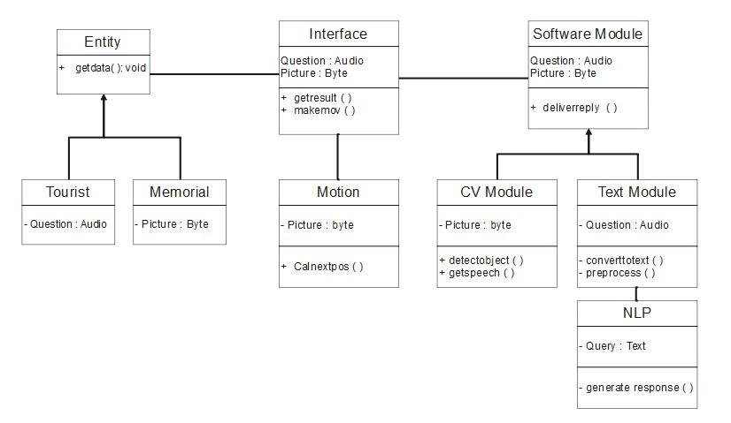
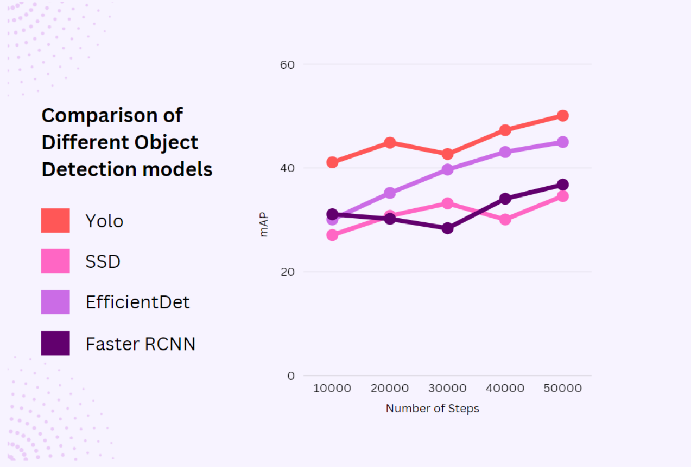
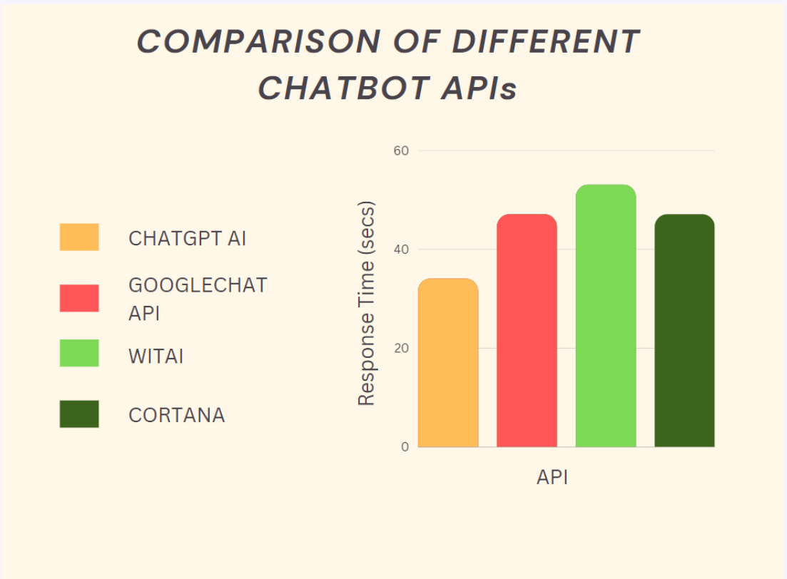

# Theano-The-Chaperone
## Introduction
Museums serve as repositories of cultural, historical, artistic, and scientific treasures, offering visitors an opportunity for education and enlightenment. However, navigating through the vast collections and interpreting the significance of artifacts can be daunting for many visitors. To address this challenge, we present a solution: an autonomous indoor tour guide robot designed to enhance the museum experience. This robot, equipped with cutting-edge technology including Object Detection, Natural Language Processing, and obstacle avoidance mechanisms, aims to provide informative and interactive tours while minimizing the reliance on human guides. By offering a user-friendly interface, voice-enabled interactions, and cost-effective navigation, our robot endeavors to make museum exploration accessible, engaging, and enriching for all visitors.

## Motivation
**Motivation:**
Our motivation stems from a desire to revolutionize the museum experience by addressing the challenges faced by visitors in understanding and appreciating artifacts. Recognizing the limitations of traditional museum tours, where valuable information often goes unnoticed due to the absence of dedicated guides or visitor engagement, we envision an autonomous indoor tour-guide robot as a solution. By leveraging cutting-edge technology, including Natural Language Processing and interactive touchscreen displays, our robot aims to provide every visitor with an accessible, informative, and engaging tour experience. Our primary goal is to reduce reliance on human labor while ensuring that all visitors, including the visually impaired, have the opportunity to explore and understand artifacts in an inclusive and enriching manner. Through the integration of advanced features and user-friendly interfaces, we aspire to captivate visitors and create a truly immersive and memorable museum visit for everyone.

## Requirements Analysis
### Software Requirements
The system requires the following software components:

1. **GPU—TPU for training:** GPU or TPU is necessary for efficient training of machine learning models.
   
2. **Tensorflow, PyTorch, OpenCV, Pandas, NumPy:** Essential libraries for machine learning, computer vision, and data processing tasks.

3. **Creating Supervised examples:** Tools and methods for generating labeled training examples to train the machine learning models.

4. **Trained Models:** Pre-trained machine learning models for object detection, natural language processing, or other relevant tasks.

5. **Code Editor:** A software environment for writing and editing code, such as Visual Studio Code, PyCharm, or Jupyter Notebook.

6. **Dataset:** A dataset containing relevant data for training and testing the machine learning models.

7. **HC-05 Config Tool (To work with Bluetooth module):** Software tool for configuring and managing the HC-05 Bluetooth module for communication with external devices.

### Hardware Requirements
The system consists of the following essential hardware devices:

1. **Robot body:** Custom-designed robot body, 3D printed, and reinforced with an aluminum extrusion structure.

2. **Large Display 26.69cm (10.5”):** A LED screen display for presentation and facial expression purposes.

3. **Neck mechanism:** Mechanism utilizing a worm and worm wheel, driven by a stepper motor, to provide degrees of freedom in the neck area.

4. **Prime mover:** NEMA 4.2 kg-cm stepper motors used as the primary driving force for movement.

5. **Arduino and Bluetooth module:** Arduino microcontroller along with a Bluetooth module for receiving signals from the main microprocessor and controlling motors accordingly.

6. **Motor shield:** A motor shield to protect the microcontroller and organize circuit connections.

7. **DC portable battery:** Portable battery to provide uninterrupted power supply to all elements of the system.

## ClassDiagram

## Frame Extraction
The `FrameExtractor.py` script provides a straightforward method for extracting frames from video files. Here's an overview of how it works:

1. **Input Video Files:** The script expects input video files to be stored in a directory named 'Videos'.

2. **Frame Extraction Process:** The script iterates through each video file in the 'Videos' directory and extracts frames at specified intervals. It calculates the duration between frames based on the desired frames per second (FPS) for saving frames.

3. **Frame Saving:** Frames are saved as individual JPEG images in a directory named 'Images', with each video file having its own subdirectory within 'Images'.

4. **Usage:** The script can be executed from the command line, and it automatically handles the frame extraction process for all video files in the 'Videos' directory.

5. **Dependencies:** The script relies on OpenCV for video processing and image manipulation, as well as NumPy for numerical computations.

6. **Customization:** Users can adjust the frames per second (FPS) for saving frames to control the number of frames extracted per second of video footage.

By running the `FrameExtractor.py` script, users can efficiently extract frames from video files for various applications such as video analysis, computer vision, and multimedia processing.
## Software Implementation

Our software implementation comprises several components designed to provide a seamless and interactive experience for visitors at the museum. Here's an overview of each component:

### 1. Image Detection

#### Object Detection Algorithms:
We utilize state-of-the-art object detection algorithms, including Faster Region-based Convolutional Neural Network (Fast R-CNN) and You Only Look Once (YOLO), to detect objects in images captured by the museum's cameras.

##### Fast R-CNN:
Fast R-CNN improves upon the original R-CNN approach by introducing shared convolutional feature computation across region proposals, eliminating redundant computations. It utilizes RoI pooling for efficient feature extraction and achieves accurate and efficient object detection.

##### YOLO:
YOLO is a single-shot object detection algorithm that provides real-time performance by processing images only once through the network. It divides the input image into grids and predicts bounding boxes and class probabilities for each grid cell. While efficient, YOLO may fail to detect all objects if multiple objects are present in a single grid.

#### Training Phase:
A comprehensive data collection methodology is crucial for developing efficient machine learning models. In our case, we gathered diverse images that
encompass various angles, lighting conditions, and occlusion events. To achieve
this, we employ an iOS device to record videos that cover all the mentioned conditions.[2]Once we have the recorded videos, we utilize the process of frame extraction
to extract individual frames from each video. This allows us to obtain a collection
of still images for further analysis and model training. We employ the OpenCV
library, which provides a range of computer vision functionalities, including video
processing and frame extraction. By utilizing OpenCV, we can efficiently capture
images from the recorded videos.
During the frame extraction process, we extract frames from the videos
at a rate of 5 frames per second. This ensures that we capture an adequate number
of frames to represent different moments in the recorded videos. To organize the
extracted frames, we save them in separate folders for each artifact. This enables
better organization and management of the collected image data. Next, we leverage
the TensorFlow object detection API, which is a powerful framework for creating
deep learning networks specifically designed to solve object detection problems.
The API provides pre-trained models in its Model Zoo, which serve as a starting
point for our work. We can fine-tune these pre-existing models, such as Fast
R-CNN, EfficientDet, etc., using our collected image data. Fine-tuning involves
adjusting the model parameters to make them more effective in our specific use
case. Additionally, we explored Darknet, an open-source neural network framework
written in C and CUDA. Darknet is specifically used for the fine-tuning of YOLO
v4, another popular object detection model. By utilizing Darknet, we can fine-tune
the YOLO v4 model to better suit our requirements and improve its accuracy in
detecting objects in our dataset.

#### Prediction Phase:
The pre-trained YOLO v4 models’ weights are obtained in the TensorFlow
SavedModel format, which specifically saves the variable weights of the models. To
create a prediction pipeline, we begin by capturing images using a camera. These
images serve as input to the pipeline. The captured images undergo a series of
preprocessing steps to ensure that the tensors representing the images are in the
appropriate format for further processing. These preprocessing steps may involve
resizing, normalization, or any other necessary transformations.[3]
Once the images have been preprocessed, they are fed into the YOLO
v4 model. The model utilizes its learned weights to make predictions on the input
images. These predictions typically involve determining the class or category of the
objects present in the images. Following the prediction step, the description of the
particular monument, corresponding to the predicted class, is delivered through
a microphone. This involves using text-to-speech technology or delivering the
description in an audible format to the user.
In summary, the pipeline begins by capturing images, preprocesses them
to prepare the tensors for the model, passes the tensors through the YOLO v4
model for object classification and finally delivers the description of the identified
monument through a microphone

### 2. Voice-Enabled Information

#### Text-to-Speech (TTS) System:
Our proposed system will consist of a camera that detects the exhibits and
retrieves information about it from the database. To achieve this, the system
will employ image recognition algorithms(YOLO) that identify the object in the
exhibit. Once the object is identified, the system will search the database (MongoDB) for relevant information related to the exhibit.The retrieved information is
in textual form and will be converted to speech using a text-to-speech engine. The
system will use a speaker to read out the information to the visitor. The textto-speech engine converts the retrieved textual information into audio output that
the visitor can hear, while the speaker enables audio output. Overall, the system
will provide a user-friendly and interactive experience for visitors at the museum.

#### VoiceBot:
Additionally, the system will have voice-enabled,question-answer interactions for visitors to learn more about the exhibit.
**Algorithm for Voicebot:**
1. User speaks to the robot.
2. The robot will use Voice Activity Detection (VAD) to detect the user’s voice
and distinguish it from background noise.
3. The robot then uses Automatic Speech Recognition (ASR) technology to transcribe the user’s speech into written text using the Speech-to-Text (STT) engine.[9]
4. The natural language Understanding (NLU) engine analyzes the text to extract
the user’s intent and essential information from the text.
5. The voicebot selects an appropriate response based on the user’s intent.
6. The response is synthesized into speech using the Text-to-Speech (TTS) engine.
7. The robot finally delivers the synthesized response to the user

#### VoiceBot Script:
The VoiceBot script integrates various components, including the OpenAI GPT-3.5 model for natural language processing, microphone recording, speech recognition, and text-to-speech conversion. Visitors can interact with the VoiceBot by asking questions, and it responds with synthesized speech.

### 3. Main Script
The main script orchestrates the entire system, capturing images, running object detection algorithms, handling visitor queries through the VoiceBot, and providing audio output through speakers. It ensures a seamless and interactive experience for museum visitors.

Our software implementation leverages cutting-edge technologies to enhance the museum experience, providing informative descriptions of exhibits and enabling interactive communication between visitors and the museum's exhibits.

## Results and Evaluation
On our dataset, 50000 steps were taken in total, and after every 10000 steps,
the mAP value for each model was recorded. The mAP of YOLO is the highest
among the four trained models, while that of SSD(Retina Net 152) is the lowest
as in the previous chart.

Response time refers to the overall amount of time between a service request
and its fulfillment. The speed and precision of a chatbot’s responses determine its
level of quality. As observed in the previous graph, ChatGPT AI has the shortest,
while Wit.ai has the longest response time.

## Introduction:-
A robot is being developed with capabilities to operate and explain physical exhibits through interaction with visitors.
This robot also takes into account other factors like choosing the shortest path, collision detection and hence making the museum tour efficient.
To make the tour user friendly it also uses the concepts of NLP so that the tourists can interact in different languages hence removing the language barrier.
This bot can replace museum guides for explaining different exhibits to the visitors giving them a technologically advanced experience.

## Objectives and Goals:-
* **Breaking down language barriers**
* **Providing a high-tech welcome - even for children**
* **Guiding the visitors with a touch of emotion and surprise**
* **Very few people visit museums nowadays, our robot can be a point of attraction to visitors, thus increasing the footprint number.**

## Hardware Block diagram

# Software

## Object-Detection
### Data Collection
### Data Preprocessing
### Data Augmentation
### Model Training and Evaluation
